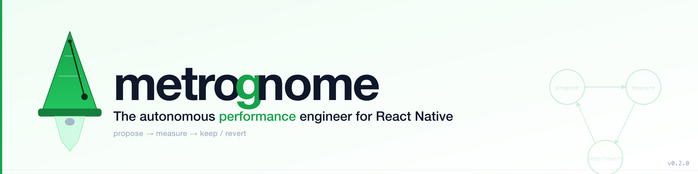
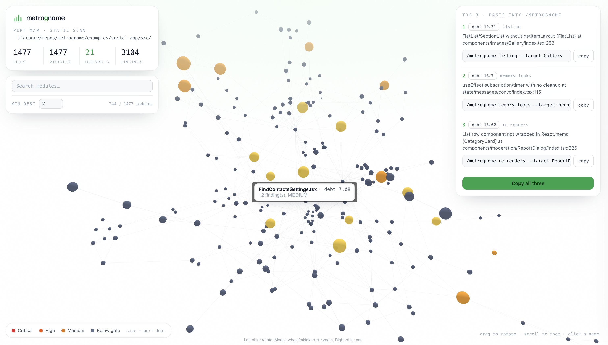
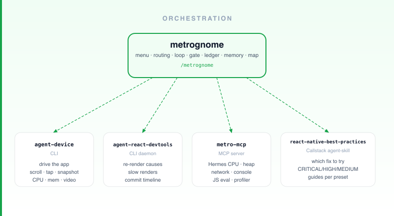
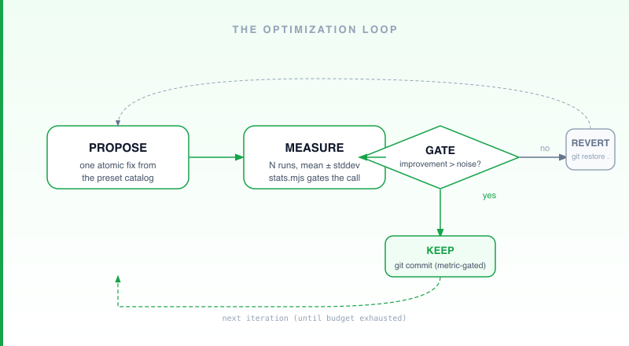
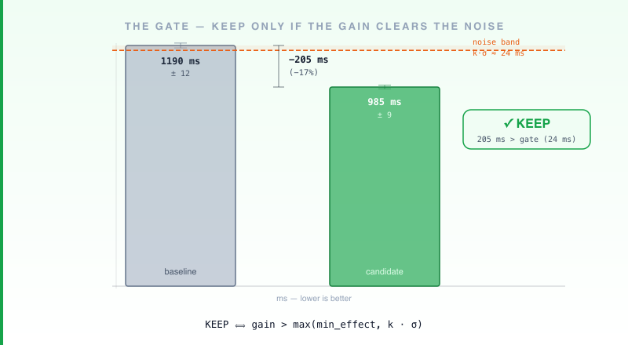
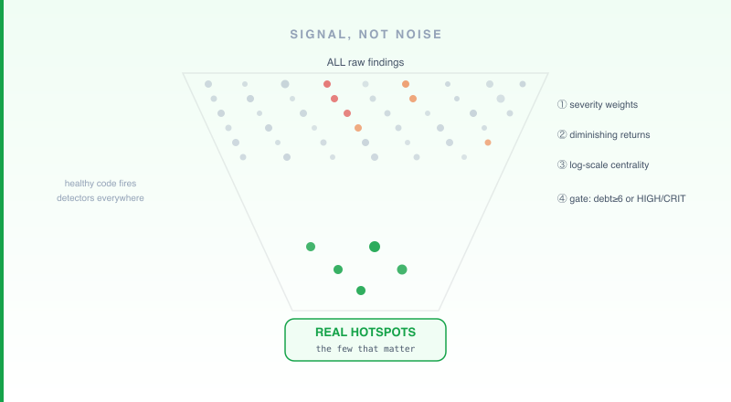

[](https://github.com/uphold/metrognome/actions/workflows/ci.yml)
[](https://github.com/uphold/metrognome/releases)
[](https://www.npmjs.com/package/metrognome)
[](https://www.npmjs.com/package/metrognome)
[](./LICENSE)
[](https://uphold.github.io/metrognome/)

> **The autonomous performance engineer for React Native.** `/metrognome`: one command turns scattered RN performance tooling into a single, scientific loop — **propose → measure → keep/revert** — that ships gains it can prove.

Works with **Claude Code, OpenAI Codex CLI, Cursor, Gemini CLI, and GitHub Copilot CLI.**

Inspired by Andrej Karpathy's `/autoresearch`. Fully adapted to React Native.

---

## What it solves

React Native performance tooling is powerful but scattered — each tool knows one thing, nothing shares context between sessions, and there's no gate between "this might help" and "this actually helped." metrognome routes each measurement to the right tool and runs a loop with a real gate: one fix at a time, measured N times, kept only if the gain is clearly bigger than the run-to-run wobble — otherwise reverted automatically.



▶ [**Explore the live 3D map**](https://uphold.github.io/metrognome/perf-map.html) — a real scan of bluesky's [social-app](https://github.com/bluesky-social/social-app) — and the [live run report](https://uphold.github.io/metrognome/report.html).

---

## Install

```
/plugin marketplace add uphold/metrognome      # or a local path to this repo
/plugin install metrognome
```

**Prerequisites:** Node ≥ 18 · React Native / Expo app on Metro + Hermes · clean git tree.

Then run **Doctor** once (`/metrognome` → **3. Doctor**) in your RN app to install the CLI tools and bootstrap `.metrognome/`.

**Scripts need `npm install`:** The SessionStart hook does this automatically inside a Claude session. For by-hand or CI use, run `npm install` in the plugin directory first.

For Codex · Cursor · Gemini · Copilot: see [COMPATIBILITY.md](./COMPATIBILITY.md).

---

## Quickstart

### Map your app (no device needed)

1. Run `/metrognome` → select **Perf Map 3D**.
2. metrognome scans the repo, builds a standalone HTML map, and opens it — node **size = debt**, **color = severity**.
3. Click a hotspot → flaw, `file:line`, and the matching fix guide.
4. Copy the printed **Top-3** command, e.g. `/metrognome listing --target FeedScreen`.

**By hand** (CI / no Claude):
```bash
npm run scan -- path/to/your-rn-app --out graph.json
npm run map  -- graph.json --out perf-map.html --open
```

### Run the loop

> *Start it before bed. Wake up to a stack of metric-gated commits.*

Pick **Autoresearch** → preset (or paste a Top-3 command). metrognome picks a hypothesis, applies it, measures N times on the actual device, keeps it if the gain clearly beats the run-to-run wobble, reverts if not — then picks the next hypothesis and does it again. One variable at a time, loop after loop, until the goal is reached or the budget runs out. Real research iterations, zero human interaction.

Needs the live toolchain + Metro + a clean git tree — run Doctor first.

---

## Modes & presets

**Menu** (`/metrognome`):

| Mode | What it does |
|---|---|
| **Autoresearch** | Pick a preset; asks commit mode + live report (opt-in); runs the autonomous measure→fix→keep/revert loop. |
| **Perf Map 3D** | Device-free static scan → interactive HTML force-graph → Top-3 hotspots. |
| **Doctor** | Verifies/installs the toolchain, checks Metro + clean tree, bootstraps `.metrognome/` (including `config.json`). |
| **Configurations** | View/edit `.metrognome/config.json` — commit mode, live report, N, k, budget. |
| **Senior Engineer Audit** | Holistic reasoning scan — finds the structural debt linters miss (Context Provider recreating its value, navigator loading all screens at startup, state lifted high enough that a keystroke re-renders the whole tree). Ranked findings → pick what to fix → gate proves (or reverts) each one. |

**Commit shape** (`commitMode` in `.metrognome/config.json`): `per-iteration` (default) · `one-commit` · `no-commit`.

**Presets** (Autoresearch):

| Preset | Target metric |
|---|---|
| `first-load` | TTI — cold-start time to interactive |
| `listing` | FPS / jank — dropped frames in FlatList/SectionList/FlashList |
| `memory-leaks` | RAM — JS heap growth across open↔close cycles |
| `bundle-size` | Bundle bytes — JS output size |
| `re-renders` | Re-render count — wasted component commits |

**Scripts / CLIs** (device-free unless noted):

| Script | npm alias | What it does |
|---|---|---|
| `perf_scan.mjs` | `npm run scan` | Scans an RN repo, emits `graph.json` of perf hotspots |
| `build_perf_map.mjs` | `npm run map` | Renders `graph.json` → standalone HTML 3D force-graph |
| `build_run_report.mjs` | `npm run report` | Renders `run-state.json` → live HTML progress dashboard |
| `stats.mjs` | `npm run stats:test` | Statistical gate (keep/revert decision) — self-testable |
| `build_playbook.mjs` | `npm run playbook` | Distils ledger runs into `playbook.md` + `playbook.json` (proven wins / dead ends) |
| `doctor.mjs` | `npm run doctor:test` | Toolchain check, Metro + git preflight, `.metrognome/` bootstrap + `config.json` — self-testable |
| `heap_sample.mjs` | — | JS-heap leak sampling across open↔close cycles — needs a live app |

Installed-plugin path: `${CLAUDE_PLUGIN_ROOT}/skills/metrognome/scripts/<script>`.

---

## How it works



metrognome routes each measurement to the right tool, then owns the loop, the gate, the ledger, the memory, and the map. agent-device, agent-react-devtools, and react-native-best-practices are independent open-source projects by **Callstack**; metro-mcp is an independent open-source project. metrognome conducts them — it does not bundle or modify them. See [Attribution](#attribution).

### How the loop stays honest



Each metric is measured N times (default 5, first run discarded). A fix is kept **only if the gain is clearly bigger than the run-to-run wobble** — otherwise it's reverted automatically. Per-iteration commits let `git restore .` revert anything instantly. The final commit shape is configurable. The Experiment Ledger (`.metrognome/ledger/`) records every run; Performance Memory (`.metrognome/perf-memory.md`) distills each into one durable line, committed with the app so the whole team inherits the knowledge. Exact formula: [`skills/metrognome/references/measurement.md`](skills/metrognome/references/measurement.md).



### Signal, not noise



Static RN heuristics fire constantly in healthy code. The Perf Map's scoring surfaces the structural problems that actually matter — not every inline prop and missing `memo`. How it stays selective: severity weights, diminishing returns, structural-only centrality, and a combined debt+severity gate. Scoring details and tuning constants: [`skills/metrognome/references/perf-map.md`](skills/metrognome/references/perf-map.md).

---

## CI Autopilot

metrognome also runs as a **weekly CI agent** — no human in the loop. A GitHub Actions workflow scans the repo, picks the top debt findings, autoresearches fixes, and opens a PR with the measured gains and *why* each fix was chosen.

Two templates in [`templates/ci/`](templates/ci/):
- **Device-free** (recommended): measures `bundle-size`, defers device-only findings. Runs on any `ubuntu-latest` runner, always reliable.
- **Device**: boots an Android emulator; all 5 presets measurable. Heavier, opt-in.

See [`templates/ci/README.md`](templates/ci/README.md) for setup, cost, and gotchas.

---

## Requirements & constraints

- **Node ≥ 18**; React Native / Expo app on Metro + Hermes.
- **Clean git tree required** — git is the experiment log; auto-revert needs a clean baseline. Doctor refuses to run dirty.
- **Perf Map + stats are device-free.** The live loop needs a simulator/emulator/device + a running Metro session.
- **`bundle-size` runs headless** (CI-friendly). `listing`, `re-renders`, `memory-leaks`, `first-load` need a live device or simulator.
- **Live-loop toolchain** (installed via Doctor): `agent-device`, `agent-react-devtools`, `metro-mcp` (bundled), `react-native-best-practices`.
- **Discipline:** one variable per iteration; never record an unmeasured fix.

For iOS Simulator FPS limits, RN < 0.85 CDP constraints, and Expo/New Arch timeout workarounds: see [COMPATIBILITY.md](./COMPATIBILITY.md).

---

## Repo layout

```
.claude-plugin/      plugin.json + marketplace.json (self-installable)
.mcp.json            bundles metro-mcp
commands/            /metrognome entrypoint
hooks/               SessionStart (npm install) + UserPromptSubmit (perf-memory nudge)
skills/metrognome/
  SKILL.md           the orchestrator (menu, routing, loop, gate, ledger, memory, config)
  references/        presets · tools · measurement · perf-map · memory · navigation
  scripts/           perf_scan · build_perf_map · build_run_report · stats · build_playbook · doctor · heap_sample
  assets/            vendored 3d-force-graph · HTML templates · ledger template · sample run-state
docs/                banner.svg/png · perf-map.png · diagrams/ (loop · orchestration · gate · signal-vs-noise)
examples/            sample-rn-app fixture with seeded anti-patterns
```

In the target RN repo, Doctor bootstraps:
- `.metrognome/perf-memory.md` — cumulative performance brain (committed with the app)
- `.metrognome/screen-map.md` — navigation brain: launch, auth, and route steps to each screen (committed with the app; secrets referenced by `$NAME`, never inlined)
- `.metrognome/secrets.local.json` — `$NAME` → value map for screen-map auth steps (gitignored)
- `.metrognome/config.json` — run settings: commit mode, live report, N, k, budget
- `.metrognome/ledger/` — verbose per-run experiment logs
- `.metrognome/archive/` — compacted old memory
- `.metrognome/.gitignore` — excludes generated artifacts (`report.html`, `run-state.json`, `secrets.local.json`)

---

## Attribution

metrognome orchestrates these independent open-source tools. agent-device, agent-react-devtools, and react-native-best-practices are by **Callstack**; metro-mcp is by its own contributors. None are bundled or modified here; all trademarks and copyrights belong to their owners.

- **metro-mcp** — MCP server bridging Metro via CDP — https://www.npmjs.com/package/metro-mcp
- **agent-device** — device-driving CLI — https://www.npmjs.com/package/agent-device
- **agent-react-devtools** — React telemetry CLI daemon — https://www.npmjs.com/package/agent-react-devtools
- **react-native-best-practices** — perf knowledge base — https://github.com/callstackincubator/agent-skills

The Perf Map vendors, unmodified, the offline browser build of **3d-force-graph** by Vasco Asturiano (MIT) — https://github.com/vasturiano/3d-force-graph (license in `skills/metrognome/assets/3d-force-graph.LICENSE`).

## License

MIT — see [LICENSE](./LICENSE).
